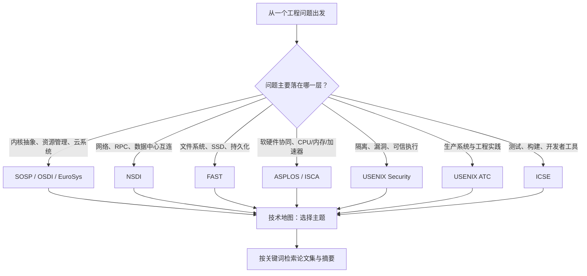

# OS 内核与系统顶会论文地图

> 面向刚进入系统、内核、云基础设施或 AI 推理系统方向的同学。本页以本仓库实际收录的 venues 和研究分类为边界，给出“从会议到问题、从问题到论文、从论文到站内检索”的阅读地图。

## 0. 如何使用本地图

本仓库当前收录以下十个会议的 proceedings：**SOSP、OSDI、NSDI、ASPLOS、EuroSys、ISCA、FAST、USENIX Security、USENIX ATC、ICSE**。其中前九个是 OS 内核与系统研究的主要入口；ICSE 用于连接系统软件工程、测试和开发工具。

“顶会”不是一个跨领域统一排名。本地图中的定位表示它对某类问题的**首选关注入口**，而不是排他性归属：例如存储论文也会发表在 SOSP/OSDI，内核安全论文也会发表在 ASPLOS 或 SOSP。



仓库内的直接入口：

- [交互式技术地图](../website/tech-map.html)：按 OS 技术主题展开，点击节点会进入关键词检索或领域精选。
- [会议论文集](../website/conference.html)：按 venue 与年份浏览完整 proceedings。
- [站内搜索](../website/search.html)：跨 proceedings 和近期 arXiv 搜索标题与摘要。
- [领域精选](../website/area-picks.html)：查看仓库分类器筛选出的近年论文。

## 1. 会议地图：每个 venue 主要回答什么问题？

| 会议 | 最适合解决的问题 | 与内核工作的关系 | 建议优先检索词 |
|---|---|---|---|
| **SOSP** | 是否需要新的系统抽象或资源管理方式？ | 进程、隔离、存储、分布式系统、可扩展 OS | `kernel`, `resource management`, `isolation`, `storage` |
| **OSDI** | 新的 OS/云系统机制能否在真实规模落地？ | 内核路径、虚拟化、网络、内存、AI 基础设施 | `Linux`, `virtualization`, `scheduler`, `inference` |
| **NSDI** | 网络化服务如何做到低延迟、高吞吐、可扩展？ | 网络栈、RDMA、RPC、负载均衡、远程内存 | `RDMA`, `RPC`, `datacenter`, `kernel bypass` |
| **ASPLOS** | OS 如何利用或约束硬件能力？ | 内存层次、异构加速、虚拟化、性能隔离 | `NUMA`, `CXL`, `GPU`, `memory system` |
| **EuroSys** | 系统机制如何以严谨但工程化的形式推进？ | 云原生、运行时、OS、可观测性、性能分析 | `container`, `runtime`, `eBPF`, `latency` |
| **ISCA** | 硬件架构改变后，软件栈的瓶颈在哪里？ | CPU、cache、TLB、内存一致性、加速器 | `cache`, `TLB`, `coherence`, `accelerator` |
| **FAST** | 数据如何可靠、高效地落盘、恢复与共享？ | VFS、块层、SSD/NVMe、文件系统、崩溃一致性 | `file system`, `NVMe`, `crash consistency`, `SSD` |
| **USENIX Security** | 系统边界在哪里，如何抵御攻击？ | 内核内存安全、sandbox、TEE、容器与微隔离 | `kernel security`, `sandbox`, `TEE`, `memory safety` |
| **USENIX ATC** | 有效的系统工程如何服务于生产负载？ | 高性能 I/O、部署、可观测性、存储与云 | `performance`, `I/O`, `cloud`, `observability` |
| **ICSE** | 怎样让复杂系统可测试、可维护、可演进？ | 内核测试、静态分析、开发工作流、AI 辅助工程 | `testing`, `program analysis`, `debugging`, `developer tools` |

## 2. 从内核子系统出发的论文地图

### 2.1 进程、调度与资源隔离

**要回答的问题：** 谁获得 CPU、内存和 I/O？多租户下如何兼顾吞吐、尾延迟、公平性和隔离性？

| 阅读切入点 | 代表论文 | 会议 | 读完应掌握的机制 |
|---|---|---|---|
| 内核故障隔离 | *Nooks: An Architecture for Reliable Device Drivers* | SOSP 2003 | 驱动隔离、故障恢复、内核可信边界 |
| 多核 OS 抽象 | *The Multikernel: A New OS Architecture for Scalable Multicore Systems* | SOSP 2009 | 核间消息传递、硬件异构与状态复制 |
| 低延迟服务调度 | *Shenango: Achieving High CPU Efficiency for Latency-sensitive Datacenter Workloads* | NSDI 2019 | 用户态调度、核心让渡、尾延迟 |
| 云端资源管理 | *Borg: Large-scale cluster management at Google with Borg* | EuroSys 2015 | 配额、优先级、资源调度与生产约束 |

**站内检索顺序：** `scheduler` → `cgroup` → `latency` → `real-time scheduling` → `NUMA balancing`。

### 2.2 虚拟内存、NUMA 与内存扩展

**要回答的问题：** 当内存访问不再均匀、内存不再只在本机时，页、cache 和分配策略如何变化？

| 阅读切入点 | 代表论文 | 会议 | 读完应掌握的机制 |
|---|---|---|---|
| 远程内存 | *Infiniswap: Managing Remote Memory at Scale in the Cloud* | NSDI 2017 | RDMA 远程换页、内存池化、故障处理 |
| 面向应用的远端内存 | *AIFM: High-Performance, Application-Integrated Far Memory* | OSDI 2020 | 用户态运行时、对象迁移、内存分层 |
| 硬件感知 OS | *The Multikernel* | SOSP 2009 | NUMA/异构下的可扩展性设计思维 |

**站内检索顺序：** `virtual memory` → `page table` → `NUMA` → `remote memory` → `CXL` → `memory tiering`。

### 2.3 存储、文件系统与崩溃一致性

**要回答的问题：** 在设备会掉电、介质有写放大、数据必须恢复的前提下，如何设计正确的 I/O 路径？

| 阅读切入点 | 代表论文 | 会议 | 读完应掌握的机制 |
|---|---|---|---|
| 闪存文件系统 | *F2FS: A New File System for Flash Storage* | FAST 2015 | segment 清理、冷热数据分离、NAND 特性 |
| 软更新与一致性 | *Soft Updates: A Technique for Eliminating Most Synchronous Writes in the Fast File System* | USENIX ATC 1994 | 元数据依赖、有序写与一致性 |
| 大规模文件存储 | *The Google File System* | SOSP 2003 | chunk、复制、副本恢复和应用接口 |
| 数据中心存储 | *Flat Datacenter Storage* | OSDI 2012 | 去中心化元数据、可扩展存储控制面 |

**站内检索顺序：** `file system` → `crash consistency` → `journaling` → `NVMe` → `persistent memory` → `object storage`。

### 2.4 网络、I/O 与内核旁路

**要回答的问题：** 数据包和 I/O 请求在什么位置排队、复制、同步？哪些路径应留在内核，哪些应交给用户态？

| 阅读切入点 | 代表论文 | 会议 | 读完应掌握的机制 |
|---|---|---|---|
| 快速 RPC | *eRPC: Fast RPCs over Modern Datacenter Networks* | NSDI 2019 | 拥塞控制、CPU 效率、零拷贝边界 |
| 用户态数据面 | *IX: A Protected Dataplane Operating System for High Throughput and Low Latency* | OSDI 2014 | 设备直通、保护域、polling I/O |
| 内核作为控制面 | *Arrakis: The Operating System Is the Control Plane* | OSDI 2014 | 虚拟化硬件队列、应用直接使用 I/O 资源 |
| 高效异步 I/O | `io_uring` 设计与 Linux 内核文档 | 工程资料 | submission/completion queue、批处理、减少系统调用 |

**站内检索顺序：** `network stack` → `RDMA` → `kernel bypass` → `asynchronous I/O` → `io_uring` → `eBPF`。

### 2.5 虚拟化、容器与可信隔离

**要回答的问题：** 如何以足够低的开销提供安全隔离，并保留接近裸机的性能？

| 阅读切入点 | 代表论文 | 会议 | 读完应掌握的机制 |
|---|---|---|---|
| 受控特权能力 | *Dune: Safe User-level Access to Privileged CPU Features* | OSDI 2012 | VT-x、用户态特权能力、陷入与隔离 |
| 高性能 I/O 隔离 | *Arrakis* | OSDI 2014 | IOMMU、硬件队列与控制/数据面分离 |
| 可验证微内核 | *seL4: Formal Verification of an OS Kernel* | SOSP 2009 | 形式化规格、功能正确性、可信计算基 |

**站内检索顺序：** `hypervisor` → `KVM` → `container` → `namespace` → `cgroup` → `microVM` → `TEE`。

### 2.6 安全、可靠性与内核可验证性

**要回答的问题：** 如何让不可信代码、设备驱动或攻击者无法突破系统边界？如何尽早发现内核 bug？

| 阅读切入点 | 代表论文 | 会议 | 读完应掌握的机制 |
|---|---|---|---|
| 驱动可靠性 | *Nooks* | SOSP 2003 | 隔离与恢复是可靠性机制，不只是一种安全机制 |
| 形式化验证 | *seL4* | SOSP 2009 | 可证明的内核正确性与验证成本 |
| 系统调用模糊测试 | *syzkaller* 及 Linux 社区实践 | 工程资料 | syscall 生成、覆盖率反馈、最小化复现 |
| 内核动态检测 | KASAN、KCSAN、KFENCE | Linux 内核文档 | 内存错误、数据竞争和低开销采样检测 |

**站内检索顺序：** `kernel security` → `sandbox` → `memory safety` → `fuzzing` → `formal verification` → `trusted execution`。

### 2.7 硬件—OS 协同与 AI 系统

**要回答的问题：** CPU、内存、网络、GPU/NPU 的新能力如何改变 OS 资源模型？

| 研究问题 | 首选 venue | 关注机制 |
|---|---|---|
| Cache/TLB/一致性对软件性能的影响 | ISCA、ASPLOS | locality、page size、coherence、prefetch |
| CXL、远端内存、内存池化 | ASPLOS、OSDI、NSDI | tiering、placement、带宽与延迟隔离 |
| GPU/NPU 多租户推理 | ASPLOS、OSDI、EuroSys、ATC | device scheduling、memory sharing、QoS |
| LLM Serving | OSDI、EuroSys、ATC、NSDI | KV cache、batching、disaggregation、tail latency |
| 端侧 AI | ASPLOS、ISCA、EuroSys | energy、heterogeneous scheduling、NPU、privacy |

**站内检索顺序：** `LLM serving` → `KV cache` → `inference serving` → `on-device` → `NPU` → `GPU scheduling`。

## 3. 以会议为轴的最小阅读书单

如果新员工暂时没有明确子方向，可按下面顺序建立系统直觉。每一篇都应回到本仓库，继续搜索它的后续工作、对比工作与近年变体。

1. **SOSP** — *The Google File System*：理解一个系统论文如何把抽象、故障模型与评估连成整体。
2. **OSDI** — *Dune*：理解 OS 如何借助硬件虚拟化安全地下放能力。
3. **NSDI** — *Infiniswap*：理解网络如何成为内存系统的一部分。
4. **ASPLOS/ISCA** — 选择一篇与当前 CPU、GPU 或 CXL 平台相关的论文：训练“硬件约束会改变软件设计”的意识。
5. **FAST** — *F2FS*：理解介质特性怎样塑造文件系统布局与回收策略。
6. **USENIX Security** — 选择与当前产品威胁模型相符的一篇 sandbox/TEE/内存安全论文：先明确攻击面，再讨论机制。
7. **USENIX ATC** — 选择一个可复用的生产系统：观察论文如何报告部署规模、故障、运维成本与性能收益。
8. **ICSE** — 选择一篇测试、静态分析或 AI 辅助开发论文：将内核正确性纳入工程闭环。

## 4. 读一篇系统论文时必须画出的图

不要先逐段翻译论文。建议先在笔记里画出下面四部分；画不出来往往意味着还没有抓住系统的本质。

```text
工作负载 / 故障模型
        │
        ▼
已有设计的瓶颈 ──► 新抽象或关键机制 ──► 数据路径与控制路径
        │                                      │
        └──────────────────► 代价、限制与失败模式 ◄── 评估指标
```

请逐项回答：

1. 论文服务的工作负载是什么？它的 SLO 是吞吐、平均延迟、P99、成本还是可靠性？
2. 旧方案的瓶颈在哪一层：算法、锁、cache、系统调用、网络、设备，还是运维流程？
3. 新设计改变了什么边界：内核/用户态、控制面/数据面、单机/分布式、软硬件之间？
4. 付出的代价是什么：复杂度、可移植性、隔离性、资源浪费、恢复时间或尾延迟？
5. 在我们现有系统中，哪一个假设不成立？如何设计一个最小验证实验？

## 5. 与本仓库的工作流对齐

```text
技术地图选主题
    ↓
站内搜索：技术词 + 约束词（例如 “RDMA tail latency”）
    ↓
会议论文集：按 venue / 年份确认上下文
    ↓
领域精选：发现近期延伸工作
    ↓
记录：问题 → 机制 → 代价 → 可复现实验
```

推荐的关键词组合：

| 目标 | 检索式示例 |
|---|---|
| Linux 性能分析 | `Linux kernel scheduler latency` |
| 多租户推理 | `LLM serving QoS isolation` |
| 高性能网络 | `RDMA RPC tail latency` |
| 端侧内存优化 | `on-device memory NPU` |
| 存储一致性 | `file system crash consistency` |
| 内核安全 | `kernel memory safety fuzzing` |
| 云原生隔离 | `container microVM sandbox` |

## 6. 12 周新人阅读与实践路线

| 周次 | 主题 | 产出 |
|---|---|---|
| 1–2 | Linux 进程、虚拟内存、VFS、网络栈概览 | 画一张本团队服务的请求路径图 |
| 3–4 | 调度、锁、RCU、内存屏障与性能观测 | 用 `perf` 或 eBPF 定位一个真实热点 |
| 5–6 | 选择存储、网络或虚拟化专题 | 精读两篇同主题、不同 venue 的论文 |
| 7–8 | 安全与可靠性 | 为一个组件整理威胁模型和故障模型 |
| 9–10 | AI Serving 或端侧推理专题 | 将模型加载、内存、设备和网络路径画成图 |
| 11–12 | 复现或微型原型 | 写出一页实验报告：假设、指标、结果、局限 |

每周固定产出一页论文卡片即可：**论文要解决什么、关键机制、数据路径、代价、一个可验证假设、三个后续检索词**。

## 7. 维护说明

- 会议清单的配置源为 [`hubs/os-kernel/venues.json`](../hubs/os-kernel/venues.json)。
- 研究方向与关键词的配置源为 [`hubs/os-kernel/categories.json`](../hubs/os-kernel/categories.json)。
- 交互式技术地图的配置源为 [`hubs/os-kernel/tech-map.json`](../hubs/os-kernel/tech-map.json)。
- 本文刻意以“代表论文”而非“必读全集”组织；新增 venue 或研究方向时，应同步更新对应配置和此地图的检索建议。
